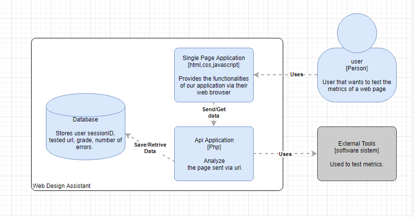
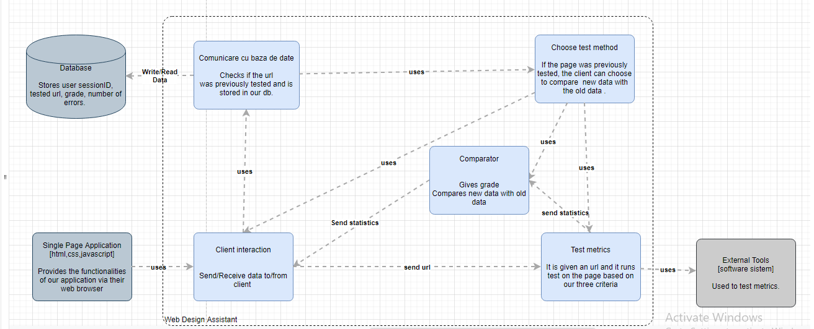

<h2>Web Design Assistant - Arhitectura</h2>

<!-- first title -->
 <h2><b>1. Tehnologii utilizate </b></h2> 
  <ul>
    <li>Protocolul utilizat pentru transmiterea datelor intre client (browser) si aplicatie este HTTP/HTTPS.</li>
    <li>Datele transmise vor fi in format JSON. </li>
    <li>Pentru client vom folosi : html, css, javascript .</li>
    <li>Pentru aplicatie vom folosi : PHP .</li>
  </ul>

<!--2nd title -->
<h2><b> 2. Detalii de implementare </b></h2> 

 Vom folosi modelul arhitectural "Model-view-controller" (MVC) utilizat în ingineria software. Succesul modelului se datorează izolării logicii de business față de considerentele interfeței cu utilizatorul, rezultând o aplicație unde aspectul vizual sau/și nivelele inferioare ale regulilor de business sunt mai ușor de modificat, fără a afecta alte nivele.
 

 Aplicatia utilizeaza sesiuni pentru fiecare client pentru a oferi optiunea de a arata erorile unui site testat anterior de un utilizator si a face comparatii pentru a se vedea progresul. 
 

 
 De asemenea folosim “server sent events” pentru a notifica clientul cand am terminat de procesat statisticile si aceastea pot fi afisate utilizatorului.
 

 	Pentru a minimiza timpul de asteptare a clientului vom folosi fire de executie pentru a analiza paginia pe cele trei criterii in mod concurent.

 

<b>Aplicatia va analiza o pagina web dupa trei criterii :</b>   
1.Design 
 <ul>
  <li>Color Contrast Accessibility Validator</li>  
</ul>

2.Code quality  
<ul>
<li>Html validator</li>
<li>Css validator</li>
<li>Responsive</li>
<li>Compressed images</li>
<li>Link Checker</li>
<li>browser compatibility</li>
</ul>

3.Performance
<ul>
 <li>Popularity Check</li> 
 <li>Website Security Check</li> 
<li>Loading speed </li>
<li>Availability Check </li>
 </ul>

 

 <b>Utilizam servicii oferite de :</b>

 

Design :  
<li>http://wave.webaim.org // constrast </li>
 
Code quality :  
 <li>Validator.w3.org // validator html </li> 
 <li>jigsaw.w3.org/css-validator // validator css </li>
 
  
Performance : 
 <li>developers.google.com/speed/pagespeed/insights   //loading speed </li>

</ul>

<!--3rd title -->
<h2><b> 3. Modelarea datelor </b></h2> 
  
     Adresa URL a site-ului ce va fi analizat, este introdusa de utilizator prin formularul pus la dispozitie pe pagina web. Aceasta va fi trimisa prin metoda “POST” catre aplicatia noastra care va analiza site-ul folosindu-se de diferite api-uri preluand datele in format JSON. 

     Daca adresa nu a mai fost testata anterior de acel client, rezultatul analizei va fi afisat clientului fara a fi salvat. In cazul in care un utilizator a mai testat acea pagina in trecut, acestuia i se va oferi optiunea de a alege una dintre cele trei metode de analiza :  
<ol>
<li> Recalcularea statisticilor ale paginii pentru starea in care era cand a fost testata anterior, acestea fiind afisate impreuna cu statisticile pentru pagina actuala </li>
<li> Analizarea paginii acutale si afisarea progresului (doar numarul de erori pentru pagina anterior testata nu si erorile) </li>
<li> Analizarea paginii actuale fara alte comparatii cu variante mai vechi</li>
</ol>

     Pentru a avea datele unui variante anterioare a paginii aplicatia va folosi un serviciu oferit de alte aplicatii ce arhiveaza pagini web, cautand in functie de data la care utilizatorul a testat acea pagina in aplicatia oferita de noi.

     Baza de date va consta intr-un singur tabel si va fi populat cu id-ul sesiunii, URL-ul analizat de utilizator, data la care a folosit serviciul nostru pentru fiecare site testat, cat si numarul de erori pentru cele trei tipuri de statistici si nota acordata.
  

  
  <!--4th title -->
<h2><b> 4. Componente </b></h2> 

 
 <ul>
 <li> Componenta care asigura comunicarea cu interfata web  
   - Toate datele vor fi trimise si preluate prin aceasta componenta 
 </li>  
<li>Comunicarea cu baza de date  
- Popularea bazei de date  
- Si preluarea informatiilor din baza de date  
 </li>  
<li> Analizator ( Design Interfata, Cod quality, Performance )
 </li>  
 <li> Componenta pentru istoric  
 - Ofera optiunea de a alege daca analiza actuala a paginii sa fie comparata cu statistici mai vechi sau nu  
 - Foloseste serviciul oferit prin api pentru a gasi varianta mai veche a paginii intr-o arhiva online  
</li>  
<li> Componenta Comparator  
- Sa acorde o nota paginii  
- Compara datele actuale cu cele vechi si sa returneze progresul 
 </li>  

 </ul>
 
 

  <!--5th title -->
<h2><b> 5. Diagrame </b></h2> 

 <ol>

  
   <li> Diagrama use case </li>
  

 
  <li>Diagrama C4 nivel 1 : Context </li>
 
 
 
  <li>Diagrama C4 nivel 2 : Container </li>
  
  
 
   <li>Diagrama C4 nivel 3 : Componente </li>
   
 </ol>

  <!--6th title -->
<h2><b>6. Bibliografie </b></h2> 
<ul>
 <li>www.w3schools.com </li>
<li>https://uitest.com/check/ </li>
<li>https://www.draw.io/ </li>
 </ul>

